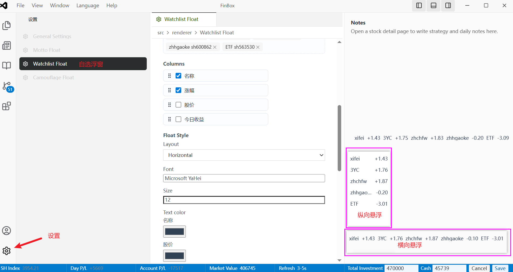
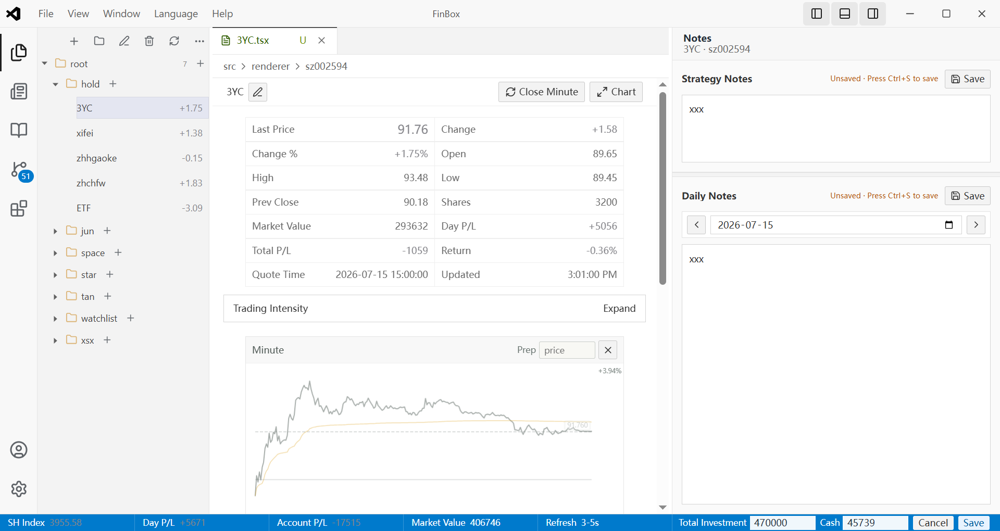
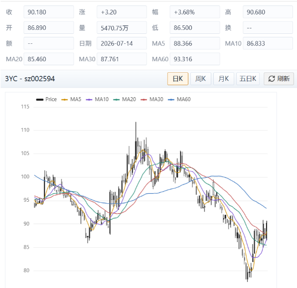
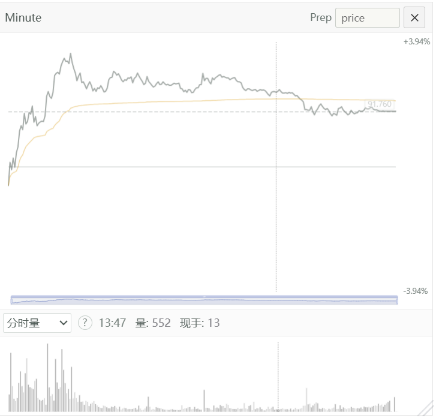
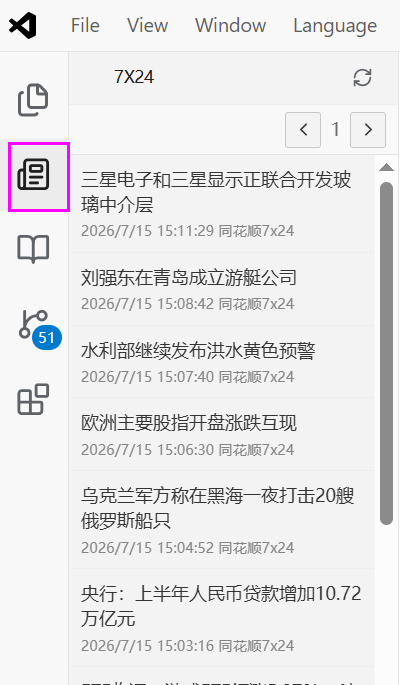

# FinBox Electron + React 版本

FinBox 盯盘软件

## 功能截图

> 以下图片为 README 展示用样例路径，可将实际截图放到 `docs/screenshots` 目录后替换文件名或图片内容。

### 自选盯盘

展示自选分组、行情涨跌幅、账户盈亏和底部市场状态栏，适合日常快速查看重点股票。



### 个股详情与笔记

查看个股实时行情、持仓明细、标签管理，并在右侧记录策略笔记和每日复盘。



### 分时与 K 线图表

独立 K 线窗口



分时图



### 7X24 资讯

聚合市场资讯列表，方便在盯盘过程中快速关注市场动态。




## 下载
https://github.com/tuniren/fin-box/releases

1. FinBox-Setup-x.x.x-win-x64.exe（标准安装版）（推荐安装） 
2. FinBox-Portable-x.x.x-win-x64.exe（便携免安装版）

## 版本号说明

版本号采用 `x.y.z` 格式：

- `x`：大版本号，表示存在重大功能、架构或兼容性变化。
- `y`：功能版本号，表示新增功能，并保持向后兼容。
- `z`：Bug 修复版本号，表示修复问题，并保持向后兼容。

## 版本规划

### 1.1.0

- [ ] 个股执行策略笔记。
- [ ] 持股支持输入购入日期，该日期为可选项，不填写也可以。
- [ ] 支持在个股中记录日常笔记。

## 技术栈

- Electron `42.2.0`
- React + TypeScript
- Vite
- esbuild
- YAML 配置文件

## 环境要求

- Node.js 22 或更高版本
- npm 10 或更高版本

当前开发机器已验证版本：

- Node.js `v22.21.1`
- npm `11.15.0`

## 安装依赖

进入项目目录：

```bash
cd fin-box
npm install
```

## 配置文件

在 Windows 上通常位于：

```text
%APPDATA%\fin-box\config.yaml
```

其他系统通常位于：

```text
macOS: ~/Library/Application Support/fin-box/config.yaml
Linux: ~/.config/fin-box/config.yaml
```

应用首次启动会自动生成默认配置。也可以在应用中打开File -> open config。

## 打包为平台可执行程序

项目使用 `electron-builder` 打包。首次使用前先安装依赖：

```bash
npm install
```

只生成当前平台的解包目录，适合快速检查打包内容：

```bash
npm run pack
```

生成当前平台的安装包/可执行程序：

```bash
npm run dist
```

按指定平台打包：

```bash
npm run dist:win
npm run dist:mac
npm run dist:linux
```

打包产物默认输出到 `release` 目录。

常见产物：

- Windows：`FinBox-1.0.0-win-x64.exe`，包含 NSIS 安装包和 portable 可执行程序
- macOS：`.dmg` 和 `.zip`
- Linux：`.AppImage` 和 `.deb`

注意：

- 通常只能在当前系统上稳定打包当前平台。Windows 上适合打包 Windows，macOS 上适合打包 macOS。
- macOS 签名、公证，以及 Windows 代码签名需要额外证书配置；未配置时仍可生成本地测试包，但系统可能提示未知开发者。
- 如果修改版本号，产物文件名中的版本会跟随 `package.json` 的 `version`。

