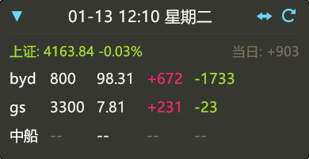

# FinBox 使用说明文档 (User Manual)

FinBox 是一款极简风格的原生桌面悬浮窗应用，专为上班族设计，用于实时监控自选股票行情及持仓盈亏。它具有体积小、资源占用低、无边框、置顶显示等特点，类似于输入法状态栏，旨在提供无干扰的监控体验。





## 1. 核心功能

*   **极简悬浮窗**：仅 240x28 像素的迷你窗口，无系统边框，永远置顶，不遮挡工作视线。
*   **实时行情**：自动获取新浪财经实时数据，交易时间段智能高频刷新。
*   **盈亏监控**：支持配置持仓成本，自动计算**单股盈亏**、**当日盈亏**及**账户总盈亏**。
*   **隐私模式**：默认显示系统时间，支持快捷键切换查看盈亏数据，有效保护隐私。
*   **跨平台支持**：支持 Windows、macOS 和 Linux，自适应系统字体。

## 2. 界面交互指南

### 2.1 基础操作
*   **拖拽移动**：鼠标按住窗口任意空白区域（鼠标变为抓手图标 ✋），即可将窗口拖动到屏幕任意位置。
*   **模式切换**：
    *   **时间模式**（默认）：显示当前日期、时间及星期。
    *   **盈亏模式**：显示 `<总盈亏> | <今日盈亏>`。
    *   **切换方式**：
        1.  点击界面右侧的 `↔` 按钮。
        2.  使用快捷键 **`Ctrl + Alt + 8`**。
*   **展开/收起**：点击左侧的 `▶` 按钮展开自选股列表，查看个股详情；点击 `▼` 收起。
*   **手动刷新**：点击右侧的 `⟳` 按钮强制刷新数据。

### 2.2 右键菜单
在窗口任意位置点击**鼠标右键**，唤出功能菜单：
*   **🛠 打开配置**：直接打开配置文件所在的文件夹（或文件），方便修改持仓信息。
*   **❌ 退出程序**：关闭并退出应用。

### 2.3 数据展示说明
*   **颜色规则**：
    *   **红色**：盈利 / 上涨
    *   **绿色**：亏损 / 下跌
    *   **灰色**：持平 / 无数据 / 辅助文本
*   **列表内容**（从左至右）：
    1.  股票名称/代码
    2.  现价 (灰色)
    3.  当日盈亏 (红/绿)
    4.  总盈亏 (红/绿)

## 3. 配置文件说明

程序首次运行会自动生成默认配置文件。

*   **文件路径**：
    *   **Windows**: `%APPDATA%\fin-box\config.yaml`
    *   **macOS**: `~/Library/Application Support/fin-box/config.yaml`
    *   **Linux**: `~/.config/fin-box/config.yaml`

*   **配置格式 (YAML)**：

```yaml
# 总投入资金 (可选，用于计算总收益率，当前版本暂未显示收益率)
total_investment: 100000.0
# 剩余可用资金 (可选)
cash: 50000.0

# 自选股列表
stocks:
  - code: "sz002594"          # 股票代码 (sz开头代表深市，sh开头代表沪市)
    alias: "比亚迪"            # 自定义别名 (可选，不填则显示API返回名称)
    positions:                # 持仓记录 (支持多笔买入)
      - account: "招商证券"    # 账户备注 (可选)
        shares: 100           # 持股数量
        cost: 250.0           # 成本单价

  - code: "sh600519"
    alias: "贵州茅台"
    positions:
      - shares: 200
        cost: 1700.0
```

*修改配置文件后保存，程序通常会自动检测并重载；如果未生效，请点击界面上的刷新按钮或重启程序。*

### 3.1 主题配置

FinBox 支持高度自定义的主题系统，您可以通过修改配置文件来调整应用外观。

*   **切换主题**：
    修改 `current_theme` 字段指定当前使用的主题名称。内置主题包括：
    *   `default`: 默认暗色主题
    *   `cyberpunk`: 赛博朋克风格

*   **自定义主题**：
    在 `themes` 字段下添加自定义主题配置。支持配置背景色、边框、文字颜色、涨跌色、圆角大小等。

**主题配置示例：**

```yaml
# 当前使用的主题
current_theme: "default"

# 主题定义列表
themes:
  # 自定义浅色主题示例
  light:
    background: "#FFFFFFE6" # 背景色 (支持 Hex 格式，如 #RRGGBBAA)
    border: "#CCCCCC"       # 边框颜色
    text_normal: "#333333"  # 普通文字
    text_white: "#000000"   # 高亮文字
    text_gray: "#666666"    # 次要文字
    color_up: "#E53935"     # 上涨颜色
    color_down: "#43A047"   # 下跌颜色
    accent: "#1976D2"       # 强调色
    menu_bg: "#F5F5F5"      # 菜单背景
    rounding: 6.0           # 圆角大小
    border_width: 1.0       # 边框宽度
```

更详细的预设主题配置参数，请参考文档 [docs/themes_example.yaml](docs/themes_example.yaml)。

## 4. 常见问题

*   **Q: 为什么显示乱码？**
    *   A: 程序已内置跨平台字体适配逻辑（优先加载微软雅黑、PingFang、Noto Sans CJK 等）。如果您的系统缺少常见中文字体，请安装相应字体或在系统设置中修复字体关联。
*   **Q: 刷新频率是多少？**
    *   A: 交易时间段（9:00-16:00）每 5 秒刷新一次；非交易时间每 60 秒刷新一次，以节省流量和性能。
*   **Q: 如何添加港股或美股？**
    *   A: 目前主要支持沪深 A 股（代码前缀 `sz`, `sh`）。其他市场取决于新浪财经 API 的支持情况，暂未做针对性适配。

## 5. 开发指南 (Development)

如果您希望参与开发或自行编译修改版，请参考以下说明。

### 5.1 环境要求
*   **Rust**: 请安装最新稳定版 Rust 工具链 (建议通过 [rustup](https://rustup.rs/) 安装)。
*   **平台**: Windows / macOS / Linux (需安装对应系统的 GTK/xcb 依赖库，详见 eframe 文档)。

### 5.2 常用命令

*   **运行 (Debug 模式)**
    ```bash
    cargo run
    ```

*   **代码检查**
    ```bash
    cargo check
    ```

*   **编译发布 (Release)**
    ```bash
    cargo build --release
    ```
    编译产物位于 `target/release/fin-box` (Windows 下为 `.exe`)。
    *注意：Release 模式下会自动隐藏控制台窗口。*

*   **清理构建缓存**
    ```bash
    cargo clean
    ```

## 6. 开源协议 (License)

本项目基于 [Apache License 2.0](LICENSE) 协议开源。

您可以自由地使用、修改和分发本软件，但必须保留原作者的版权声明和许可声明。详细条款请参阅 LICENSE 文件。
